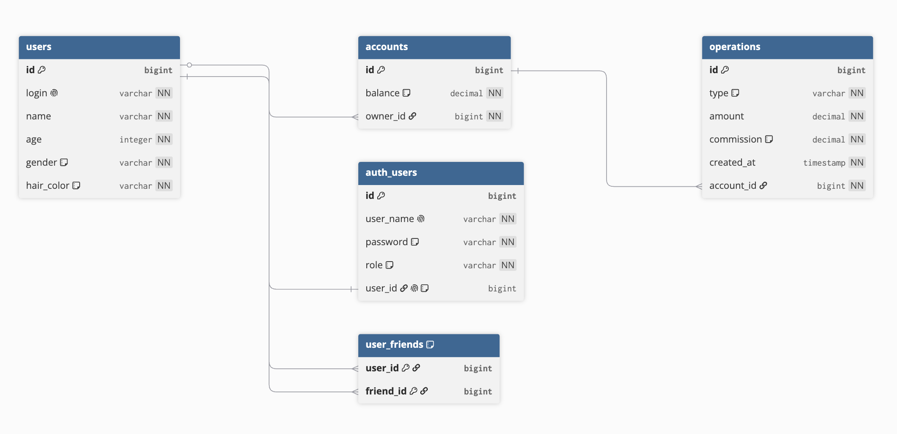

# Bank System

Многомодульный банковский сервис на Spring Boot. Реализован в рамках курса по Java.

## Описание

Банковская система с поддержкой пользователей, счетов, переводов и конвертации балансов в иностранные валюты. Состоит из двух Spring Boot приложений, общающихся между собой через Apache Kafka.

Проект разделён на модули:

- **app** — основной сервис банка (REST контроллеры, Spring Security, точка входа)
- **services** — бизнес-логика (счета, переводы, пользователи, обмен валют)
- **data-access** — слой работы с БД (JPA сущности, репозитории, мапперы)
- **core** — общие модели и исключения
- **contracts** — DTO для межсервисного взаимодействия через Kafka
- **rates-service** — отдельное приложение-поставщик курсов валют

## Стек

- Java 21
- Spring Boot 
- Spring Security
- Spring Data JPA / Hibernate
- Apache Kafka 3.7
- PostgreSQL

